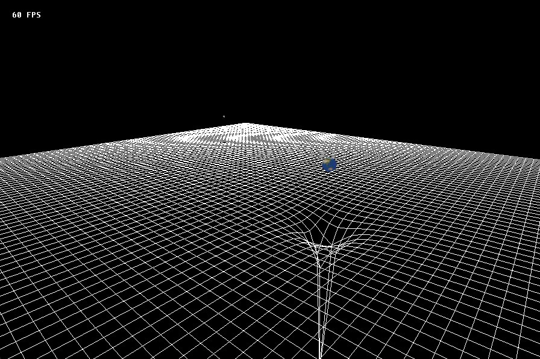

# Gravity

## Building
To get started, clone this repository with all the submodules:

```bash
git clone --recurse-submodules https://github.com/f01zy/Gravity gravity && cd gravity
```

If you have NixOS then run the nix-shell to load wayland, X11 and OpenGL dependencies:

```bash
nix-shell
```

And now build the project:

```bash
mkdir build && cd build
cmake ..
cmake --build .
```

## Usage
To launch the simulation with a custom body, pass the initial parameters as command-line arguments:

```bash
./gravity <x y z> <vx vy vz> <mass> <radius> ...
```

- `x`, `y`, `z` - Initial position coordinates (float).
- `vx`, `vy`, `vz` - Initial velocity vector (float).
- `mass` - Object mass (double, > 0).
- `radius` - Physical radius of the body (double, > 0).

For example, a scene with Earth and the Moon:

```bash
./Debug/gravity 0.0 0.0 0.0 0.0 0.0 0.0 5.972e24 6371000 0.0 0.0 384400000.0 1018.0 0.0 0.0 7.35e22 1737500
```

## Preview

